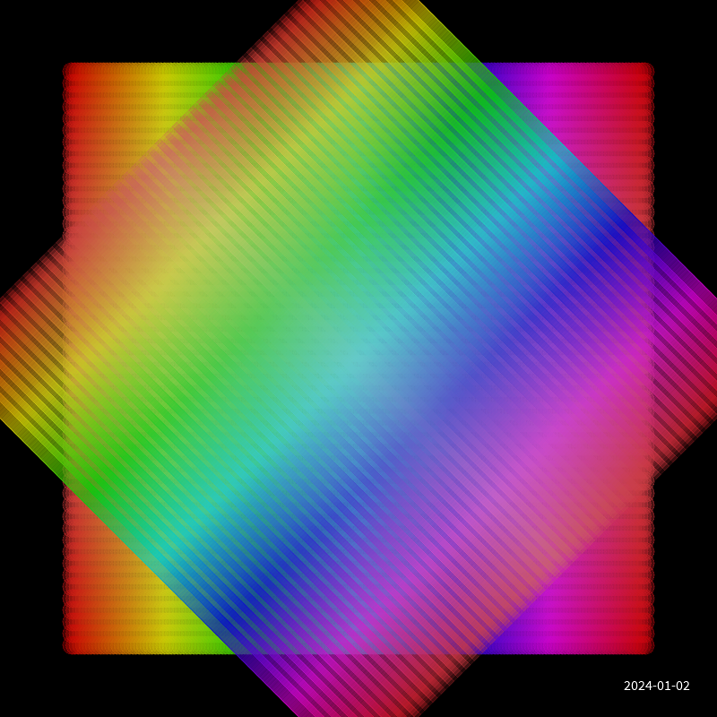
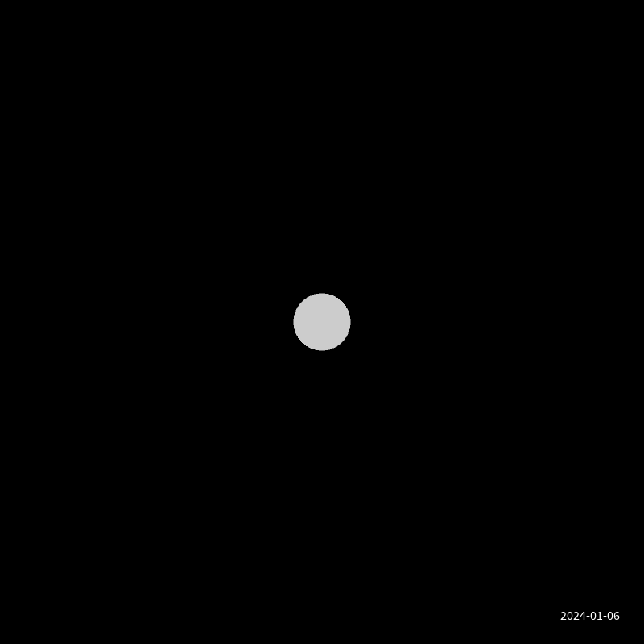
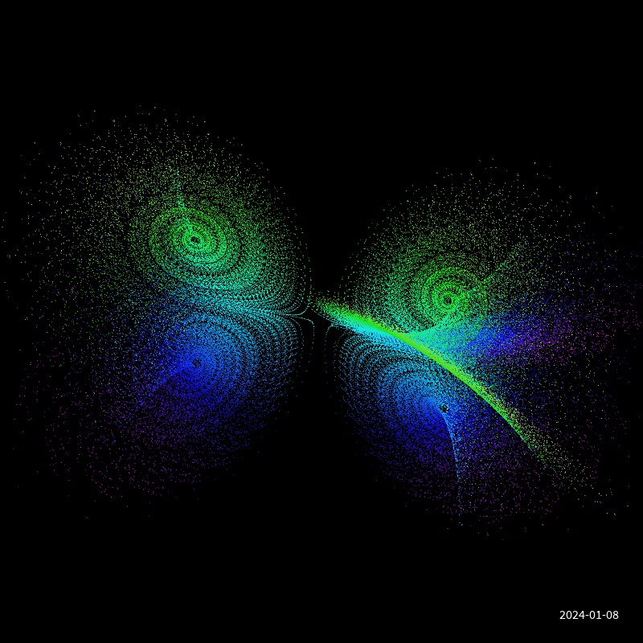
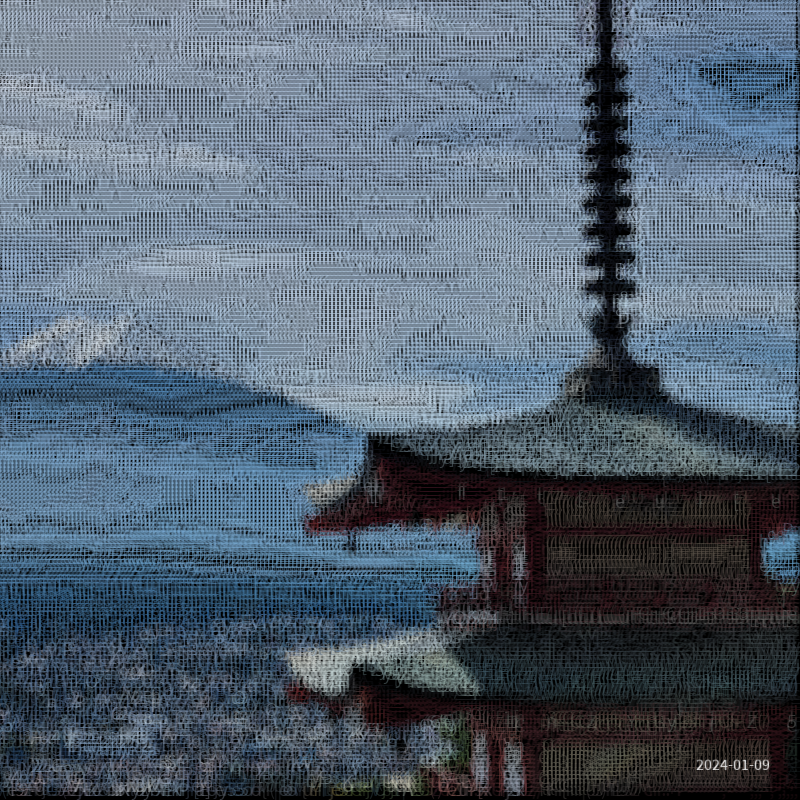

# Sketch a Day

## Coding a visual idea a day

### Inspiration

This repository is heavily inspired by [Alexandre B A Villares' "Sketch a Day"](https://abav.lugaralgum.com/sketch-a-day/).

### Where to find it

You can follow this project also on:

* My website [ericof.com](https://ericof.com/en/sketches)
* Mastodon at [@ericof@pynews.com.br](https://pynews.com.br/@ericof)
* GitHub [github.com/ericof/sketch-a-day/](https://github.com/ericof/sketch-a-day/)

## Gallery

### 2024

| Day | Description | File | Image |
| -- | -- | -- | -- |
| [2024-01-01](./sketches/d2024_01_01) | Genuary 01 - Particulas em uma caixa. | [./sketches/d2024_01_01/__main__.py](./sketches/d2024_01_01/__main__.py) |  |
| [2024-01-02](./sketches/d2024_01_02) | Genuary 02 - Sem Paleta de Cores. | [./sketches/d2024_01_02/__main__.py](./sketches/d2024_01_02/__main__.py) |  |
| [2024-01-03](./sketches/d2024_01_03) | Genuary 03 - Efeito Droste. | [./sketches/d2024_01_03/__main__.py](./sketches/d2024_01_03/__main__.py) |  |
| [2024-01-04](./sketches/d2024_01_04) | Genuary 04 - Pixels. | [./sketches/d2024_01_04/__main__.py](./sketches/d2024_01_04/__main__.py) |  |
| [2024-01-05](./sketches/d2024_01_05) | Genuary 05 - Estilo de Vera Molnár. | [./sketches/d2024_01_05/__main__.py](./sketches/d2024_01_05/__main__.py) |  |
| [2024-01-06](./sketches/d2024_01_06) | Genuary 06 - Screensaver. | [./sketches/d2024_01_06/__main__.py](./sketches/d2024_01_06/__main__.py) |  |
| [2024-01-07](./sketches/d2024_01_07) | Genuary 07 - Progress Bar. | [./sketches/d2024_01_07/__main__.py](./sketches/d2024_01_07/__main__.py) |  |
| [2024-01-08](./sketches/d2024_01_08) | Genuary 08 - Chaotic system | [./sketches/d2024_01_08/__main__.py](./sketches/d2024_01_08/__main__.py) |  |
| [2024-01-09](./sketches/d2024_01_09) | Genuary 09 - ASCII | [./sketches/d2024_01_09/__main__.py](./sketches/d2024_01_09/__main__.py) |  |
| [2024-01-10](./sketches/d2024_01_10) | Genuary 10 - Hexagons | [./sketches/d2024_01_10/__main__.py](./sketches/d2024_01_10/__main__.py) |  |
<!-- Next Item -->

### 2023

Please visit the [2023](https://github.com/ericof/sketch-a-day/blob/2023/README.md) branch of this repository.

## License

CC BY-NC 4.0 Deed - Attribution-NonCommercial 4.0 International